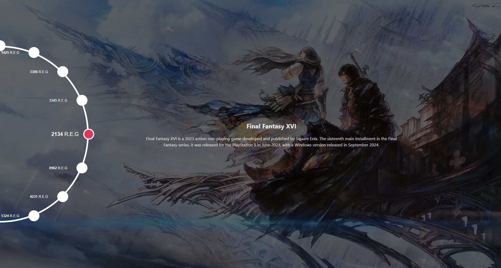

# Timeline Component Documentation

This project is a **Timeline Component** created using React and basic CSS, designed to display a circular timeline layout where each event is represented by a button positioned along a circle's perimeter. Users can interact with buttons to navigate between events, displaying related content in the center of the component.

## Preview



Preview Link: [https://trigocar.pyco.tech/](https://trigocar.pyco.tech/) 

## Folder Structure

```jsx
src
  ├── components
  │   └── Timelines
  │       ├── index.tsx               # Main Timeline component
  │       ├── TimelineCircle.tsx      # Handles circular button positioning
  │       ├── TimelineContent.tsx     # Displays active content (title and description)
  │       ├── TimelineDot.tsx         # Visual dot elements in the timeline
  │       └── TimelineStyles.css      # Styles for timeline layout and animations
  ├── constants
  │   └── mockData.ts                 # Mock data for the timeline events
  ├── hooks
  │   └── useMediaScreen.ts           # Custom hook for screen size adjustments
  ├── App.tsx                         # Main application entry point
  ├── index.css                       # Global styles
  └── main.ts                         # Main entry file for React/Vite
```

## Timeline Component

### Description

The `Timeline` component serves as the main layout and controller for displaying timeline events in a circular pattern. Each event button is arranged on a circular path, and users can click a button to rotate the circle and update the displayed event content.

### Props

- **`data`** (required): Array of event objects containing:
    - `label`: Event label.
    - `title`: Event title.
    - `description`: Event description.
    - `image`: Background image URL for the active event.
- **`radius`** (optional): Specifies the radius of the circle on which buttons are positioned. Default is `340`.

### Code Explanation

1. **State and Callback Setup**:
    - `activeButton`: Manages the index of the currently active button.
    - `positionButton`: Uses `useCallback` to calculate and set the position of each button along a circular path based on the radius and number of events.
2. **Event Positioning**:
    - In the `positionButton` function, the circular layout is achieved by calculating `x` and `y` coordinates for each button based on its angle on the circle. This layout is updated when `activeButton` or `data` changes.
3. **useEffect Hook**:
    - Runs `positionButton` initially and on changes to `radius`, ensuring button positions adapt to the specified radius.
4. **Rotation Handling**:
    - `rotateCircle` applies a rotation to `.circle-container`, which houses the buttons. This function calculates the rotation angle for smooth transitions between active events.
    - CSS transitions are controlled by adding and removing a `.rotating` class, enabling animations in `TimelineStyles.css`.
5. **Event Handlers**:
    - `handleButtonClick`: Updates `activeButton` and rotates the circle to focus on the clicked event. It recalculates the button positions based on the new active state.
6. **Render Structure**:
    - The outer `div` container displays the background image for the currently active event.
    - `TimelineCircle` renders the circular button arrangement and handles button clicks.
    - `TimelineContent` displays the title and description of the active event.

### Sample Usage in `App.tsx`

```jsx
import React from "react";
import Timeline from "./components/Timelines";
import mockData from "./constants/mockData";

function App() {
  return (
    <div>
      <h1>Event Timeline</h1>
      <Timeline data={mockData} radius={340} />
    </div>
  );
}

export default App;
```